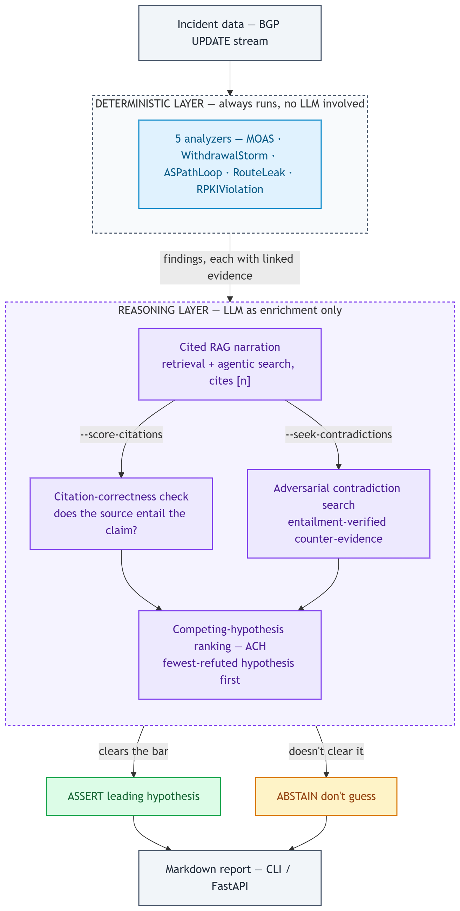

# RouteCause

**A citation-grounded BGP-incident investigator — it detects network routing
anomalies with deterministic analyzers, explains them with cited passages from
IETF RFCs, and refuses to answer when it can't ground a claim in a source.**

[](https://github.com/dim-tsoukalas/RouteCause/actions/workflows/ci.yml)
[](LICENSE)

[](https://routecause.onrender.com/docs)

[**▶ Try the live API**](https://routecause.onrender.com/docs) · [Interactive demo](https://dim-tsoukalas.github.io/RouteCause/) · [Quickstart](#quickstart) · [HTTP API](#http-api) · [Architecture](#architecture) · [Findings & results](docs/findings.md)

---

### What it is, in 30 seconds

When internet traffic gets misrouted — a BGP hijack, a route leak — engineers
sift through raw routing data to find the cause. RouteCause automates the first
pass: **deterministic detectors** (no LLM in the detection path) flag the
anomaly, then a **retrieval-augmented LLM** explains *why*, citing the exact RFC
clause behind every claim and abstaining when it can't ground one. The system is
built to **measure its own grounding** — citation precision/recall, adversarial
counter-evidence search, competing-hypothesis ranking — instead of trusting the
model's fluency.

**Stack:** Python · RAG (BM25 + dense hybrid retrieval, RRF fusion) · agentic
tool-calling loop · LiteLLM (hosted + local models) · NLI/entailment models for
automated citation checking · FastAPI service · Docker · OpenTelemetry tracing ·
offline evaluation harness · 123 tests.

## Quickstart

```bash
pip install -e .                                    # core runs on the stdlib alone — no extras, no API key
investigate pakistan-youtube-2008 --seek-contradictions
```

Detection, cited retrieval, and competing-hypothesis reasoning all run offline.
Add an LLM (`INVESTIGATOR_MODEL` + a provider key) only for natural-language
narration. Prefer Docker? `docker run --rm routecause` runs the same demo with
nothing installed — see [Run with Docker](#run-with-docker).

## What makes it different

Each point was found by measuring against 13 real historical incidents, not
asserted in a design doc — full write-ups in [docs/findings.md](docs/findings.md):

| Measured against the real 13-incident catalog | Result |
|---|---|
| Detection accuracy (5 analyzers, incl. RPKI/ROA) | **5/13** hit (was 4/13 before RPKI — [rpki-toolset-results.md](docs/rpki-toolset-results.md)) |
| Competing-hypothesis reasoning (`--ach`, 16-RFC corpus, default BM25) | **3 correct · 1 false · 9 abstained** — the false assertion is diagnosed, not hidden |
| Same, with opt-in hybrid (BM25 + dense) retrieval | **3 correct · 0 false · 10 abstained** — fixes the false assertion, unlocks no new correct calls — [hybrid-retrieval-results.md](docs/hybrid-retrieval-results.md) |
| Citation-correctness harness (`--score-citations`), a real run | caught a fluent explanation citing 4 real RFC sections at **0% actual recall** |

- **It measures its own citations.** An evaluation harness scores whether the
  cited RFC clause actually *entails* each generated claim (ALCE-style
  precision/recall, RAGChecker-style retriever-vs-generator split) — catching
  fluent narration that cites four real RFC sections all wrong (0% recall).
- **It argues against itself.** For every finding it retrieves counter-evidence
  and keeps only passages an entailment checker verifies as genuinely
  contradicting, then ranks competing hypotheses by Heuer's ACH method and
  **abstains** rather than assert when nothing clears the evidence bar.
- **Honest, reproduced results.** `evaluate.py --ach` over the real catalog
  reports **3 correct / 1 false / 9 abstained** — the one false assertion is
  diagnosed, not hidden. Trade-offs (bigger corpus, bigger NLI model, hybrid
  retrieval) are each shown to help *and* hurt, with the losing half reported.
- **Deterministic core, LLM as enrichment.** Detection never involves an LLM,
  so the model can't invent what counts as evidence — it only narrates over
  already-grounded findings.

<details>
<summary><b>See it in action</b> — the real 2008 Pakistan Telecom / YouTube hijack, real routing data, real hosted LLM (Groq), nothing hand-picked</summary>

_Question: Using the reference corpus, explain why a prefix (208.65.153.0/24)
being announced by two distinct origin ASNs (AS17557 and AS36561) is treated
as a strong indicator of a hijack or misconfiguration, and what validation
step is recommended._

**1. Deterministic detection (no LLM involved):**

```
### [CRITICAL] MOAS — 208.65.153.0/24
- Prefix 208.65.153.0/24 was announced by 2 distinct origin ASNs
  (AS17557, AS36561). Presumed legitimate origin: AS17557.
    - rrc00@2008-02-24T20:07:25Z ANNOUNCE 208.65.153.0/24 origin=AS36561
      path=[3549 36561] peer=AS3549
    - …and 58 more announcements
```

3 more analyzers also fired (AS-path loop, route leak, RPKI/ROA violation) —
full detail in [demo/sample-run-full.md](demo/sample-run-full.md).

**2. LLM explanation, cited against the RFC corpus:**

> According to [1], a BGPsec speaker should only originate a BGPsec UPDATE
> message advertising a route for a given prefix if there exists a valid ROA
> authorizing the BGPsec speaker's AS to originate routes to this prefix. If
> two distinct origin ASNs (AS17557 and AS36561) are announcing the same
> prefix, it indicates that at least one of them does not have a valid ROA —
> a strong indicator of a hijack or misconfiguration. The recommended
> validation step is to check the prefix against the RPKI data set, as
> described in [2].

`[1] RFC 8205 §4.1` · `[2] RFC 7454 §6.1.2.2.2` · `[3] RFC 8206 §3.1` · `[4] RFC 8205 §8.1`

**3. The system checks its own citations** — nothing above is trusted just
because it reads fluently; an independent entailment checker verifies each
cited claim actually appears in its source:

```
citation precision: 100%   citation recall: 25%

[OK]   "a BGPsec speaker should only originate ... if there exists
        a valid ROA ..."                              -> RFC 8205 §4.1 ✓
[MISS] "at least one of them does not have a valid ROA ..."
                                        -> uncited (retriever gap)
```

Two more of the model's claims went uncited too — reported, not hidden. This
is the mechanism the whole project is built around.

**4. Competing hypotheses, ranked** (not just the top one asserted):

```
1. MOAS            — 2 supporting, 2 contradicting   <- leading hypothesis
2. AS-path loop     — 1 supporting, 3 contradicting
3. RPKI violation   — 1 supporting, 3 contradicting
4. Route leak       — 0 supporting, 4 contradicting

Verdict: MOAS asserted on relevance-tier evidence (2 vs 2 contradicting,
conservative strict-entailment count: 2) — stated explicitly, not silently
picked.
```

Reproduce this yourself: `investigate pakistan-youtube-2008 --seek-contradictions --score-citations`
(needs `INVESTIGATOR_MODEL` + a provider key, e.g. Groq's free tier). Full
untrimmed transcript — every evidence line, all 4 findings, full ACH detail —
in [demo/sample-run-full.md](demo/sample-run-full.md); an earlier such run is
also written up in [docs/findings.md](docs/findings.md#full-transcript-the-2008-pakistan-telecom--youtube-hijack).

</details>

## Run with Docker

No local Python needed — the image bundles the 16-RFC corpus and real incident
data, so the demo runs fully offline:

```bash
docker build -t routecause .
docker run --rm routecause                          # the 2008 Pakistan/YouTube hijack demo
docker run --rm routecause rostelecom-2020 --seek-contradictions
docker run --rm --entrypoint ask routecause "how is a BGP AS_PATH loop detected?"
docker run --rm --entrypoint pytest routecause -q   # the full test suite
```

Ready-to-run incidents: `pakistan-youtube-2008`, `rostelecom-2020`,
`indosat-2014`, `level3-comcast-2017`, `telekom-malaysia-2015`,
`google-japan-leak-2017`, `mainone-google-2018`, `twitter-rtcomm-2022`,
`celer-cbridge-2022`. Turn on narration by passing `-e INVESTIGATOR_MODEL=… -e
OPENAI_API_KEY=…` at run time (nothing is baked into the image).

**One-command smoke test** — builds the image and checks the demo, a second
incident, `ask`, and the tests:

```bash
./scripts/docker-smoke.sh          # macOS / Linux / WSL / CI
.\scripts\docker-smoke.ps1         # Windows PowerShell
```

## HTTP API

The same engine, exposed as a small FastAPI service (a thin layer over
`InvestigationEngine`, so the API and CLI can't drift). Corpus is loaded and
indexed once at startup.

**Live instance:** https://routecause.onrender.com/docs — try it in the browser.
`/investigate` returns real LLM narration **plus the citation-correctness
scorecard** that flags any claim the cited RFC doesn't actually support (Groq
free tier). Free Render tier, so the first request after a while cold-starts for
~30–60s, then it's fast.

```bash
pip install -e ".[ingest,api]"
investigator-serve                 # -> http://127.0.0.1:8000  (interactive docs at /docs)

# or in Docker:
docker run --rm -p 8000:8000 -e HOST=0.0.0.0 --entrypoint investigator-serve routecause
```

- `GET /health` · `GET /incidents`
- `POST /investigate` — `{"incident": "pakistan-youtube-2008", "seek_contradictions": true}` → structured findings, cited explanation, ACH ranking, Markdown report.
- `POST /ask` — `{"question": "…"}` → a cited answer over the RFC corpus (or an honest abstention).

**Deploy a live copy (free):** a [`render.yaml`](render.yaml) blueprint deploys
the API as a free Docker web service (Render → *New → Blueprint → connect repo*;
no credit card). A Hugging Face Space config is in
[`deploy/huggingface/`](deploy/huggingface/).

## Observability

The LLM/agent path is instrumented — one span per investigation, one per model
completion (model, prompt/completion size, latency). Off by default; one env var
turns it on:

```bash
INVESTIGATOR_TRACING=console investigate pakistan-youtube-2008   # structured spans on stderr, zero extra deps
INVESTIGATOR_TRACING=otlp    investigator-serve                  # export to Phoenix / Langfuse / Jaeger (pip install -e ".[obs]")
```

## Install & extras

```bash
pip install -e .             # core: analyzers, BM25 retrieval, offline CLI, ACH — stdlib only
pip install -e ".[ingest]"   # mrtparse — pull real incidents from RIPE RIS / RouteViews
pip install -e ".[llm]"      # litellm — natural-language narration
pip install -e ".[nli]"      # sentence-transformers — real cross-encoder / MiniCheck checkers
pip install -e ".[api,obs]"  # FastAPI service · OpenTelemetry tracing
pip install -e ".[all]"      # everything, incl. dev (pytest)
```

`investigate` also accepts a path to any incident JSON, and
`python -m investigator.ingest` builds new incidents from raw MRT archives — see
[docs/findings.md](docs/findings.md) and `docs/design.md`.

## Architecture

Two layers, honestly separated (full detail in [`docs/design.md`](docs/design.md)):

<p align="center">
  <a href="docs/architecture.png">
    
  </a>
</p>

- **Deterministic layer** (`investigator/analyzers/`) — a config-driven toolset
  registry (mirrors K8sGPT's `IAnalyzer`). Always runs, unconditionally, with no
  LLM involved. The agentic loop never gets a say in what counts as evidence.
- **Reasoning layer** (`investigator/retrieval/` + `agent.py` + `llm.py`) — a
  citation engine (LlamaIndex-style `CitationQueryEngine`) inside a bounded,
  context-budgeted agentic loop (HolmesGPT-style), orchestrated by
  `engine.py`. Offline does one search round; a real LLM may search further.

## More

- [docs/findings.md](docs/findings.md) — measured results, the full transcript, capability list, roadmap, layout
- [docs/design.md](docs/design.md) — architecture and phase-by-phase design
- [docs/corpus-expansion-results.md](docs/corpus-expansion-results.md) · [docs/hybrid-retrieval-results.md](docs/hybrid-retrieval-results.md) · [docs/rpki-toolset-results.md](docs/rpki-toolset-results.md) — honest before/after write-ups
